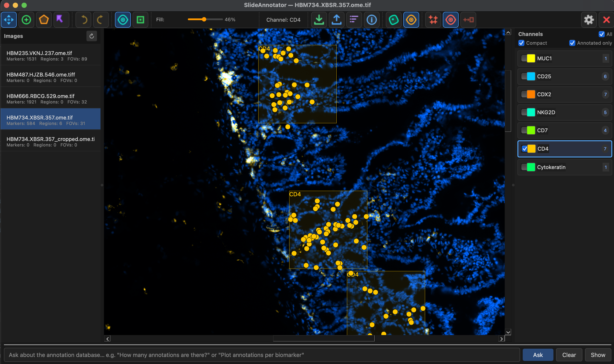

# SlideAnnotator

A desktop annotation tool for multiplex immunofluorescence (mIF) whole-slide images. Built with PySide6, pyvips, and numpy.



*The main window: the left **Images** panel lists slides with live marker / region / FOV counts, the central pyramid-aware viewer shows composited channels (blue DAPI nuclei, orange CD4 markers) with labelled FOV boxes, the right **Channels** panel gives per-channel colour, visibility, and annotation counts, and the bottom bar accepts natural-language questions about the annotation database.*

## Features

- **Multi-channel viewer** — display and composite any number of fluorescence channels, each with an independently configurable colour, visibility toggle, and min/max intensity range.
- **Pyramid-aware tile renderer** — loads the correct pyramid level for the current zoom and streams tiles in background threads with an LRU cache, keeping the UI responsive on large images.
- **Cell marker tool** — click to place point annotations on any channel; markers render at a fixed screen size regardless of zoom. Toggle `B` or the toolbar button to switch between dot display and bounding-box display.
- **Region tool** — freehand-draw polygon regions.
- **Select tool** — click or shift-click to select markers/regions/FOVs, drag to reposition, press `D`/`Delete`/`Backspace` to delete.
- **Selection in annotation mode** — while the cell-marker or region tool is active, hold `Shift` to select, move, and delete annotations without switching tools:
  - **Shift+click** on an annotation to select it (click again to deselect).
  - **Shift+drag** on a selected annotation to move it (all selected annotations move together). Works for markers, regions, and FOVs.
  - **Shift+drag** on empty canvas to draw a rubber-band rectangle and select everything inside it.
  - `D` / `Delete` / `Backspace` deletes all currently selected annotations.
- **Pan tool** — drag to pan; right-click drag pans in any tool mode.
- **Field-of-View (FOV) annotations** — press `F` to stamp a 512 × 512 px rectangle centred on the cursor. FOVs are saved as part of the annotation sidecar.
- **FOV image export** — **File → Save FOV Images…** crops each FOV at full resolution and saves a PNG per FOV in an `images/` folder next to the slide. Channel assignment follows fluorescence conventions: DAPI or Hoechst → blue; remaining visible channels → red / green.
- **Cell marker export** — **File → Export Cell Markers (txt)…** writes a text file listing, for every FOV, the bounding boxes of all markers that fall inside it.
- **Annotation visibility toggle** — press `Space` or click the eye button in the toolbar to show / hide all annotations instantly.
- **Annotation persistence** — annotations are saved in a SQL database, in a configurable directory for fast retrieval and better maintenance.
- **View settings persistence** — per-image channel visibility, colour, and intensity range are saved automatically to `viewsettings.json` next to the slide and restored when reopening.
- **Configurable settings** — `settings.yaml` at the project root (or `~/.config/slideannotator/settings.yaml`) controls application-level behaviour. All settings can also be edited and saved at runtime via **StarDist → Settings**.
- **Unsaved-changes guard** — prompts to save before opening a new image or quitting.
- **Colorful icon toolbar** — tool buttons use crisp QPainter-drawn icons (pan, marker, region, select, eye, box-marker, save, load, quit) instead of text characters, avoiding platform emoji rendering issues.
- **StarDist nucleus segmentation** — run StarDist (ONNX) inference on all FOVs in a background thread; detected cell outlines are overlaid on the slide. Toggle outline visibility with the toolbar button; customise all application settings (paths, appearance, FOV size) via **StarDist → Settings**.
- **Cell detection** — run an ONNX object-detection model on all FOV tiles in a background thread. The model family is auto-detected from the ONNX input/output signature, so D-FINE, RT-DETR, and RF-DETR detectors are interchangeable via a single `cell_det_model` setting. The active marker channel is mapped to red, DAPI/Hoechst to blue. Detected cells appear as zoom-invariant cross markers. Use the toolbar **Convert** button to turn detections into cell marker annotations.
- **Configurable input normalization** — detectors support selectable preprocessing via `cell_det_norm`: `imagenet` (16-bit scale to 0–1 then ImageNet mean/std) or `none` (16-bit scale to 0–1 only). Set it in `settings.yaml` or from the settings dialog.
- **Model evaluation** — evaluate a cell-detection model against your ground-truth annotations. Results appear in a sortable, filterable, and editable table, with markers/images selectable by train/test group.
- **Image list panel** — a left-hand sidebar lists every slide image found under the configured `data_dir`, split into **Train** / **Test** sections. Each entry shows live annotation counts (markers / regions / FOVs) drawn from the SQLite database. Double-click any entry to open that slide.
- **SQLite annotation database** — annotations are written to a SQLite database (WAL mode) in addition to JSON sidecars, enabling fast cross-slide queries and powering the image list panel counts.
- **Annotation summary** — **Summary** toolbar button opens a dialog showing, across all annotation files in the configured directory, the total count of cell markers, regions, and FOVs grouped by slide and channel.
- **Image properties** — toolbar button / **File → Image Properties…** (`Ctrl+I`) shows metadata for the currently open slide (dimensions, pyramid levels, channels, etc.).
- **AI query panel** — ask questions about the annotation database in plain language from the bottom panel (e.g. "How many annotations are there?" or "Plot annotations per biomarker"). Backed by `dbagenticquery`, a read-only text-to-SQL agent that runs against the SQLite annotation database. The results panel (questions, SQL, answers) is hidden by default and only appears once a question is asked; use the **Show/Hide** button to toggle it manually. Charts are opened in their own pop-up window rather than embedded in the panel.

## Supported file formats

| Format | Extension |
|--------|-----------|
| OME-TIFF / TIFF pyramid | `.tif`, `.tiff` |
| Aperio SVS | `.svs` |
| Hamamatsu NDPI | `.ndpi` |
| Leica SCN | `.scn` |
| PerkinElmer QPTIFF | `.qptiff` |
| Imaris HDF5 | `.ims` |

## Requirements

- Python ≥ 3.12
- [PySide6](https://pypi.org/project/PySide6/) ≥ 6.6
- [pyvips](https://pypi.org/project/pyvips/) ≥ 2.2, installed as `pyvips[binary]` so libvips ships as a wheel — no system libvips needed
- [numpy](https://pypi.org/project/numpy/) ≥ 1.26
- [PyYAML](https://pypi.org/project/PyYAML/) ≥ 6.0
- [h5py](https://pypi.org/project/h5py/) ≥ 3.0 (required for Imaris `.ims` files)
- [onnxruntime](https://pypi.org/project/onnxruntime/) ≥ 1.17 (required for StarDist inference)
- [matplotlib](https://pypi.org/project/matplotlib/) ≥ 3.9 (chart rendering for the AI query panel)
- `dbagenticquery` (text-to-SQL agent powering the AI query panel; requires an LLM API key, see its own `.env` configuration)

## Installation

### Installers (no Python required)

Download the installer for your platform from the [latest release](https://github.com/rubencardenes/SlideAnnotator/releases/latest). Nothing else needs to be installed — libvips, Qt and the ONNX runtime all ship inside.

| Platform | File |
|----------|------|
| macOS (Apple Silicon) | `SlideAnnotator-<version>-macos-arm64.dmg` |
| Windows 64-bit | `SlideAnnotator-<version>-win64-setup.exe` |
| Linux x86_64 | `SlideAnnotator-<version>-x86_64.AppImage` |

**macOS.** The app is not yet signed with an Apple Developer ID, so Gatekeeper blocks it on first launch ("SlideAnnotator is damaged and can't be opened"). Open the DMG, drag the app to Applications, then either right-click it and choose **Open** (confirm once), or run:

```bash
xattr -dr com.apple.quarantine /Applications/SlideAnnotator.app
```

**Linux.** Mark the AppImage executable before running it: `chmod +x SlideAnnotator-*.AppImage`.

The nucleus-segmentation model is bundled, so StarDist works out of the box on macOS. The larger cell-detection models are published as separate release assets — download the one you need and register it under `cell_det_models` (see [Configuration](#configuration)).

> Platform note: StarDist nucleus segmentation requires a compiled extension that currently exists only for macOS on Apple Silicon. On Windows and Linux the rest of the app works normally, but that feature reports itself as unavailable.

### From source (development)

```bash
# Clone and enter the repo
git clone <repo-url>
cd SlideAnnotator

# Create a virtual environment and install (uv recommended)
uv sync

# Or with plain pip
pip install -e .
```

### Building the installers

```bash
uv sync --group build

./packaging/build_macos.sh        # -> dist/SlideAnnotator-<version>-macos-arm64.dmg
./packaging/smoke_test.sh         # verify the bundle is self-contained

pwsh -File packaging/build_windows.ps1   # Windows
./packaging/build_linux.sh               # Linux
```

CI builds all three on every release (`.github/workflows/release.yml`); a manual `workflow_dispatch` run builds them as artifacts without publishing a release.

## Usage

```bash
# Via the installed entry-point
slideannotator

# Or directly
python main.py
```

Open an image with **File → Open Image** (`Ctrl+O`).

### Keyboard shortcuts

| Shortcut | Action |
|----------|--------|
| `Ctrl+O` | Open image |
| `Ctrl+S` | Save annotations |
| `Ctrl+E` | Export cell markers to txt |
| `Ctrl+I` | Show image properties |
| `Ctrl+Q` | Quit |
| `Space` | Toggle annotation visibility |
| `B` | Toggle markers between dot and bounding-box display |
| `F` | Place FOV rectangle centred on cursor |
| `D` / `Delete` | Delete selected annotation(s) |
| `Shift+click` | Select / deselect annotation (works in all tool modes) |
| `Shift+drag` on annotation | Move selected annotation(s) (works in all tool modes) |
| `Shift+drag` on canvas | Rubber-band rectangle selection (works in all tool modes) |
| Scroll wheel | Zoom in / out |
| Right-click drag | Pan (works in all tool modes) |

## Configuration

Running from source, SlideAnnotator reads `settings.yaml` from the project root directory first, then from `~/.config/slideannotator/settings.yaml`. **Installed from an installer it only reads `~/.config/slideannotator/settings.yaml`**, since the bundle itself is read-only. Copy `settings.example.yaml` there to get started. A minimal file looks like:

```yaml
annotations_dir: ~/data/annotations
```

API keys for the AI query panel go in `~/.config/slideannotator/.env` (environment variables already set take precedence).

| Key | Default | Description |
|-----|---------|-------------|
| `annotations_dir` | `~/data/annotations` | Directory where annotation JSON files are saved and loaded from. |
| `stardist_model` | *(none)* | Path to the StarDist ONNX model file used for nucleus segmentation. |
| `cell_det_model` | *(none)* | Path to the ONNX model file used for cell detection (D-FINE, RT-DETR, or RF-DETR — auto-detected). |
| `cell_det_norm` | `imagenet` | RF-DETR input normalization: `imagenet` (0–1 scale + ImageNet mean/std) or `none` (16-bit 0–1 scale only). Ignored by D-FINE/RT-DETR. |
| `db_path` | `~/data/annotations/annotations.db` | Path to the SQLite annotation database. |
| `data_dir` | *(none)* | Root directory scanned recursively for slide images shown in the image list panel. |
| `fov_size` | `[512, 512]` | Width and height in pixels of FOV rectangles stamped with the `F` key. |
| `outline_color` | `[0, 255, 0]` | RGB colour of StarDist nucleus outlines. |
| `outline_thickness` | `3` | Line width in pixels of StarDist nucleus outlines. |
| `region_opacity` | `50` | Default fill opacity (0–100 %) for region annotations. |
| `detections_color` | `[255, 0, 0]` | RGB colour of DFINE cell-detection cross markers. |

## FOV image export

**File → Save FOV Images…** exports each FOV as a PNG into an `images/` folder next to the slide file. File names follow the pattern `<image_stem>_<x>_<y>_512.png` where `x` and `y` are the top-left level-0 pixel coordinates.

Channel assignment uses at most 3 channels (the currently visible ones):

| Visible channels | Blue | Green | Red |
|-----------------|------|-------|-----|
| 1 | — | — | — (grayscale PNG) |
| 2 | DAPI / Hoechst | — | other channel |
| 3+ | DAPI / Hoechst | 2nd other | 1st other |

If no DAPI or Hoechst channel is visible the last visible channel is assigned to blue.

## Cell marker export format

**File → Export Cell Markers (txt)…** produces a plain-text file. Each line covers one FOV that contains at least one marker:

```
<image_stem>_<fov_x>_<fov_y>: x1,y1,x2,y2 x1,y1,x2,y2 ...
```

Each bounding box is a 20 × 20 px square centred on the marker, in level-0 pixel coordinates.

## Project structure

```
slideannotator/
├── app.py                  # Entry point, logging setup
├── settings.py             # App-level settings loaded from settings.yaml
├── viewsettings.py         # Per-image channel view settings (save / restore)
├── inference/
│   ├── stardist.py         # StarDistONNX — ONNX model wrapper
│   ├── stardist_worker.py  # QRunnable background inference worker
│   ├── stardist_utils.py   # Pre/post-processing helpers
│   ├── CellONNXInference.py  # D-FINE / RT-DETR / RF-DETR ONNX cell detection models
│   ├── cell_det_worker.py  # QRunnable background cell detection worker
│   └── nms.py              # Non-maximum suppression
├── ui/
│   ├── main_window.py      # Main window, menus, file I/O
│   ├── annotation_toolbar.py  # Icon toolbar (QPainter-drawn icons)
│   ├── channel_panel.py    # Per-channel controls
│   ├── image_list_panel.py # Right sidebar: image list with annotation counts
│   ├── summary_dialog.py   # Annotation summary dialog
│   ├── image_properties_dialog.py  # Slide metadata dialog
│   ├── agent_panel.py      # Bottom panel: natural-language queries over the annotation DB
│   ├── widgets/
│   │   └── chart_canvas.py # Matplotlib canvas + pop-up chart window
│   └── stardist_settings_dialog.py  # Full settings dialog (paths, appearance, FOV size)
├── readers/
│   ├── base.py             # ImageReader ABC + OME-XML helpers
│   ├── ome_tif.py          # ImageReaderOmeTif (pyvips)
│   ├── ims.py              # ImageReaderIms (h5py, Imaris HDF5)
│   ├── slide_reader.py     # OmeTifSlideReader — SlideReader protocol adapter
│   ├── ims_slide_reader.py # ImsSlideReader — SlideReader protocol adapter for .ims
│   └── protocol.py         # SlideReader protocol + ChannelInfo
├── tiles/
│   ├── tile_manager.py     # Tile request dispatch + LRU caching
│   ├── tile_worker.py      # QRunnable background tile loader
│   └── tile_cache.py       # LRU cache
├── graphics/
│   ├── slide_scene.py      # QGraphicsScene with tile and annotation items
│   ├── slide_view.py       # QGraphicsView with zoom/pan/key handling
│   ├── cell_marker_item.py
│   ├── cell_det_cross_item.py  # Zoom-invariant cross marker for cell detections
│   ├── fov_item.py         # FOV rectangle item
│   ├── region_item.py
│   └── tile_item.py
├── compositing/
│   └── compositor.py       # Per-channel colour + intensity compositing
├── annotations/
│   ├── models.py           # CellMarker, RegionAnnotation, FOVAnnotation, AnnotationStore
│   ├── serializer.py       # JSON load/save + txt export
│   └── database.py         # SQLite-backed annotation store (AnnotationDB)
├── tools/
│   ├── base_tool.py
│   ├── shift_select_mixin.py  # Shared Shift+select/move/rubber-band/delete behaviour
│   ├── pan_tool.py
│   ├── cell_marker_tool.py
│   ├── region_tool.py
│   └── select_tool.py
├── workers/
│   └── agent_worker.py     # QThread running DBAgenticQuery questions in the background
└── utils/
    └── colors.py           # Default channel colour assignment
```

